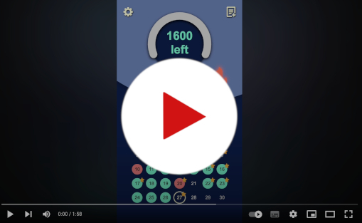

# Calorie & Workout Tracker

## neuefische capstone project

Capstone project for the neuefische web development bootcamp.

The lightweight and motivating Tracker App I always wanted.

Simple and fast tracking of your calorie intake and workout progress.

**Features:**
- **Add consumed meal:** Press ```+``` to either directly put in the name(optional) and kcal or use the
- **Quick Selection**: Press one of your custom dishes to directly add it. QS is ordered by frequence.
- **Counter:** See and delete your entries by pressing the counter. It has a colored progress bar and indicates by color if you consumed too much.
- **Add dishes:** Add a custom dish with optional further information.
- **Add workouts:** Add a Workout, then add your exercises with name, weight, repetitions, timespan and notes
- **Set Routine:** Set a routine of your workouts and rest days, to add it to the calendar.
- **Settings:** Edit your calorie goal and choose between one of 3 **Themes**.
- **Calendar:**
- - Open todays workout by pressing the pulsating date. Earn a star on the current date by completion and directly adjust values.
  - Open entries from past days by pressing on it.
  - Past dates are colored by success.
  - Show and increase the streak indicator after 3+ days of sticking to your diet.

---

!!! Not maintained further. I am currently [rebulding the app as a side project](https://github.com/WE-Kaito/calorie-and-workout-tracker-mobile) using React Native and Firebase.  

As my first graduation project, this was very rough around the edges and tought me much. 
Data is only saved in the browsers local storage, so not using a database and user accounts is also an issue, especially for mobile use.

---

Watch the demo:

[](https://www.youtube.com/watch?v=C5IOIIUKorI)
